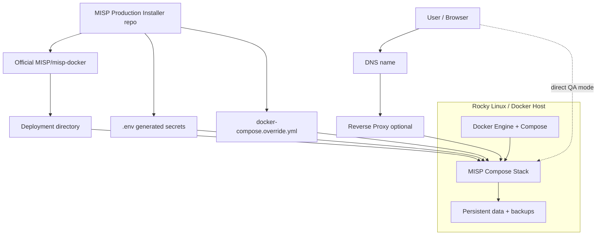

# MISP Production Installer

A clean installer/overlay repository for production-oriented MISP Docker deployments.

This repo **does not fork or vendor MISP** and **does not copy `MISP/misp-docker`**. It clones the official upstream at install/update time and adds value through generated `.env`, Compose overrides, validation, backup, update, and operational documentation.

## Why this exists

```text
official MISP/misp-docker upstream + generated environment + compose override + operational scripts
```

not:

```text
copied upstream tree + local modifications + painful rebases
```

## Overview



## Quick install: reverse proxy mode

```bash
git clone https://github.com/Tuxmint-Open-Source/misp-production-installer.git
cd misp-production-installer
sudo ./installer/prepare-host-rocky.sh
newgrp docker
./installer/install.sh \
  --install-dir /opt/misp-docker \
  --upstream-repo https://github.com/MISP/misp-docker.git \
  --upstream-ref master \
  --base-url https://misp.example.com \
  --admin-email admin@example.com \
  --admin-org ExampleOrg \
  --timezone Europe/Zurich \
  --exposure reverse-proxy \
  --bootstrap-tls
```

Reverse proxy target: `https://127.0.0.1:8443`.

## Quick install: direct QA mode

```bash
./installer/install.sh \
  --install-dir /opt/misp-docker \
  --upstream-ref master \
  --base-url https://misp-qa.example.com \
  --admin-email admin@example.com \
  --admin-org ExampleOrg \
  --exposure direct-qa \
  --bootstrap-tls
```

This binds MISP directly to host ports 80/443. Use only on controlled lab networks.

## Login

```bash
grep -E '^(ADMIN_EMAIL|ADMIN_PASSWORD)=' /opt/misp-docker/.env
```

Rotate the password after first login.

## Day-2 operations

```bash
./installer/status.sh --install-dir /opt/misp-docker
./installer/doctor.sh --install-dir /opt/misp-docker
./installer/backup.sh --install-dir /opt/misp-docker
./installer/update.sh --install-dir /opt/misp-docker --upstream-ref <tag-or-commit>
```

## Design rules

1. Keep official upstream clean.
2. Prefer `.env` and `docker-compose.override.yml` over file patches.
3. If patching upstream ever becomes necessary, make it explicit, version-gated, and documented.
4. Generate URL-safe Redis passwords because Redis backs PHP sessions and CSRF validation.
5. Keep healthchecks independent from public DNS/reverse proxy.
6. After first container start, wait for the MISP heartbeat, run `Admin runUpdates`, and verify schema readiness before declaring the install healthy.
7. Backup before every update.

## Docs

- `docs/architecture.md`
- `docs/upgrade-path.md`
- `docs/troubleshooting.md`
