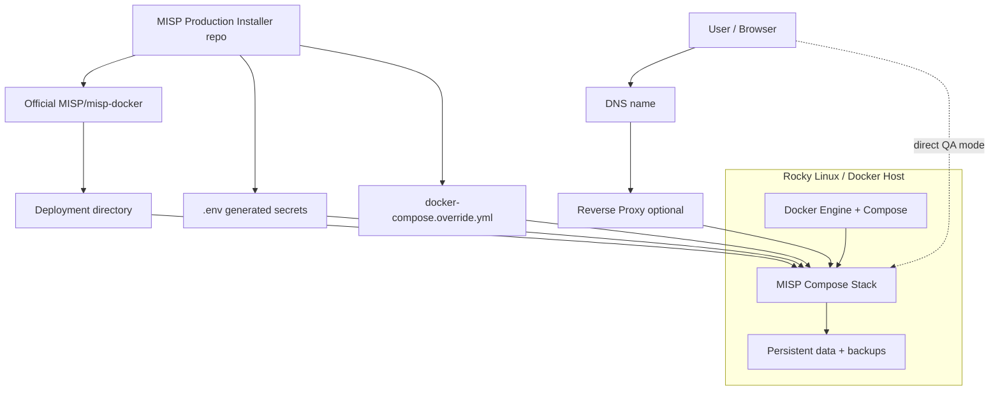

# MISP Production Installer

> [!CAUTION]
> **NOT PRODUCTION READY**
>
> This repository is under active development. APIs, configuration, behavior, and data structures may change without notice.
> Do not use this project in production environments yet.

> [!NOTE]
> Contributions are welcome. Feel free to open an issue or submit a pull request.

A clean installer/overlay repository for production-oriented MISP Docker deployments.

Current installer version: `0.3.3`

This repo **does not fork or vendor MISP** and **does not copy `MISP/misp-docker`**. It clones the official upstream at install/update time and adds value through generated `.env`, Compose overrides, validation, backup, update, and operational documentation.

## Core idea

This project is a **non-invasive lifecycle wrapper** around the official
`MISP/misp-docker` repository for a single-server Docker deployment.

It keeps upstream clean and focuses on making the operational lifecycle safer and
more convenient: install, configuration generation, validation, backup, update,
health checks, login checks, troubleshooting, and reset.

There is **no lock-in**. If you delete this installer repository after a
successful install, the deployment directory remains a normal official
`MISP/misp-docker` checkout. You can continue managing it manually with Docker
Compose exactly as upstream `misp-docker` intends. This project is a helpful
lifecycle and management add-on, not a required runtime dependency.

It is not a fork, not a transformed upstream snapshot, and not a Kubernetes or
multi-node orchestration layer.

## What this gives you

- Fresh install of official `MISP/misp-docker` with generated secrets and production-oriented defaults.
- Single-server Docker lifecycle scripts for install, backup, restore, update, validation, login checks, and reset.
- Deterministic MISP component image tags instead of implicit Docker `latest`.
- Optional explicit component tag selection for older/specific MISP component versions.
- Backup-first update workflow for moving to latest or specific MISP component versions.
- Non-invasive generated configuration through `.env` and `docker-compose.override.yml` instead of patching upstream files.
- No lock-in: the resulting `/opt/misp-docker` deployment can be managed manually without this repository.

## Version model: installer vs MISP components

There are three separate version concepts:

| Concept | Controlled by | Purpose |
| --- | --- | --- |
| Installer version | this repo's `VERSION`, Git tags, GitHub Releases | Version of these helper scripts and docs |
| Upstream checkout | `--upstream-ref` | Official `MISP/misp-docker` branch/commit used in `/opt/misp-docker` |
| Runtime component images | `CORE_RUNNING_TAG`, `MODULES_RUNNING_TAG`, `GUARD_RUNNING_TAG` | Actual MISP container image tags used by Docker Compose |

The installer default is `version-tags`: it reads upstream `CORE_TAG`, `MODULES_TAG`, and `GUARD_TAG` from official `template.env`, then pins matching runtime image tags in `.env`.

Check current upstream component versions:

```bash
./installer/get-current-misp-versions.sh
```

Compare a local install against upstream:

```bash
./installer/get-current-misp-versions.sh --install-dir /opt/misp-docker
```

## Compatibility with official MISP Docker components

This installer is useful only when it works with the official MISP Docker component set it installs or updates to. Compatibility is therefore tracked as a pair: installer release/ref plus official MISP component tags.

| Installer release/ref | MISP core | MISP modules | MISP guard | Status |
| --- | ---: | ---: | ---: | --- |
| `v0.3.3` release tag | `v2.5.43` | `v3.0.8` | `v1.2` | ✅ Validated compatible |
| current `main` at PR #22 validation time | `v2.5.43` | `v3.0.8` | `v1.2` | ✅ Validated compatible |
| `v0.3.2` release tag | `v2.5.43` | `v3.0.8` | `v1.2` | ❌ Validation failed |

For the full compatibility matrix, status definitions, and detailed reports, see [`docs/compatibility.md`](docs/compatibility.md).

For the path toward the first production-ready major release, see [`docs/production-readiness.md`](docs/production-readiness.md). The intended `v1.0.0` support scope is documented in [`docs/support-matrix.md`](docs/support-matrix.md).

## Real-world validation

The `v0.3.1` release was validated on a freshly recreated Rocky Linux VM using the published GitHub release artifact.

The validation covered:

- Docker host preparation from a fresh VM
- fresh install with older/specific MISP component tags
- update to latest upstream-declared component tags
- MISP database migrations
- external redirect checks
- `doctor.sh` and `login-check.sh`
- real browser login with Playwright-controlled Chromium

See:

- [`docs/validation/real-world-v0.3.1.md`](docs/validation/real-world-v0.3.1.md)
- [`docs/validation/matrix.md`](docs/validation/matrix.md)

## Core workflows

### 1. Fresh install with latest official MISP component versions

This is the default path. It uses the latest official component versions declared by upstream `template.env` on `master`.

```bash
git clone https://github.com/Tuxmint-Open-Source/misp-production-installer.git
cd misp-production-installer
sudo ./installer/prepare-host-rocky.sh
sudo ./installer/install.sh \
  --install-dir /opt/misp-docker \
  --upstream-ref master \
  --base-url https://misp.example.com \
  --admin-email admin@example.com \
  --admin-org ExampleOrg \
  --timezone Europe/Zurich \
  --exposure reverse-proxy
```

By default, `prepare-host-rocky.sh` does **not** add your user to the Docker group because Docker group membership is effectively root-equivalent on the host. Use `sudo` for Docker lifecycle commands, or rerun host preparation with `--add-current-user-to-docker-group` only if you accept that trade-off on a trusted single-operator system.

Reverse proxy target for default `reverse-proxy` mode:

```text
https://127.0.0.1:8443
```

### 2. Fresh install with specific MISP component versions

Use explicit component tag overrides:

```bash
sudo ./installer/install.sh \
  --install-dir /opt/misp-docker \
  --upstream-ref master \
  --base-url https://misp.example.com \
  --admin-email admin@example.com \
  --admin-org ExampleOrg \
  --timezone Europe/Zurich \
  --exposure reverse-proxy \
  --core-tag v2.5.40 \
  --modules-tag v3.0.8 \
  --guard-tag v1.2
```

Only use component tag combinations that upstream has published to the container registry. The installer does not build custom MISP images.

### 3. Update MISP components to latest official versions

Default update:

```bash
sudo ./installer/update.sh --install-dir /opt/misp-docker
```

Equivalent explicit form:

```bash
sudo ./installer/update.sh \
  --install-dir /opt/misp-docker \
  --upstream-ref master \
  --image-track version-tags
```

The update script creates a backup first, fetches upstream, synchronizes component image tags, pulls images, restarts containers, runs MISP DB updates, verifies schema readiness, and runs `doctor.sh`.

For restore-based rollback drills, store the pre-update backup outside the deployment directory:

```bash
sudo ./installer/update.sh \
  --install-dir /opt/misp-docker \
  --backup-root /var/backups/misp
```

### 4. Update MISP components to specific versions

```bash
sudo ./installer/update.sh \
  --install-dir /opt/misp-docker \
  --core-tag v2.5.40 \
  --modules-tag v3.0.8 \
  --guard-tag v1.2
```

Use this when you intentionally want a known component set instead of the newest upstream-declared tags.

## Exposure modes

### `reverse-proxy` default

MISP binds to localhost ports for a reverse proxy:

```text
127.0.0.1:8080
127.0.0.1:8443
```

Put Caddy, Nginx, Traefik, HAProxy, or another reverse proxy in front of it.

### `direct-qa` lab mode

```bash
sudo ./installer/install.sh \
  --install-dir /opt/misp-docker \
  --upstream-ref master \
  --base-url https://misp-qa.example.com \
  --admin-email admin@example.com \
  --admin-org ExampleOrg \
  --exposure direct-qa \
  --bootstrap-tls
```

This binds MISP directly to host ports 80/443. Use only on controlled lab networks.

Do **not** use `https://localhost` as `BASE_URL` for remote browser access. MISP uses `BASE_URL` for redirects, so a remote browser would be redirected to its own localhost. The installer rejects loopback `BASE_URL` values in `direct-qa` mode.

## Post-install checks and login

Run health and login checks:

```bash
sudo ./installer/doctor.sh --install-dir /opt/misp-docker
sudo ./installer/login-check.sh --install-dir /opt/misp-docker
```

`login-check.sh` prints human-readable guidance by default. For automation, monitoring, or AI-agent diagnostics, use stable key/value output:

```bash
sudo ./installer/login-check.sh --install-dir /opt/misp-docker --machine-readable
```

Show the generated admin email without printing the password:

```bash
sudo ./installer/admin-credentials.sh --install-dir /opt/misp-docker
```

The install summary also points to this helper. It is the safest way to confirm
the generated `BASE_URL` and admin account without exposing the password in
terminal scrollback.

Print the initial password only on a trusted terminal:

```bash
sudo ./installer/admin-credentials.sh --install-dir /opt/misp-docker --show-password
```

Rotate the password after first login.

On the first start, the MISP login page can appear before the application is actually ready to accept the generated admin credentials. The installer now waits for the upstream readiness log line:

```text
MISP is now live. Users can now log in.
```

Do not treat the visible login form alone as the readiness signal. Wait until the installer prints `MISP reports interactive login is ready.` before using the Web UI. If a manual `login-check.sh` run fails with an invalid-credentials marker immediately after startup, MISP may still be finishing first-start initialization; wait for the readiness message or inspect `installer/logs.sh` before assuming the generated password is wrong.

## Day-2 operations

```bash
./installer/status.sh --install-dir /opt/misp-docker
./installer/doctor.sh --install-dir /opt/misp-docker
./installer/admin-credentials.sh --install-dir /opt/misp-docker
./installer/login-check.sh --install-dir /opt/misp-docker
./installer/backup.sh --install-dir /opt/misp-docker
./installer/restore.sh --backup-dir /opt/misp-docker/backups/misp-backup-YYYYMMDDTHHMMSSZ --install-dir /opt/misp-docker
./installer/update.sh --install-dir /opt/misp-docker
```

Failed install cleanup; dry-run first, then rerun with `--yes` if the plan is correct:

```bash
./installer/reset-installation.sh --install-dir /opt/misp-docker
./installer/reset-installation.sh --install-dir /opt/misp-docker --yes
```

Docker Engine itself is not removed by the reset script.

## Validated in v0.3.0

The `v0.3.0` release was validated on a disposable lab VM with these public-safe workflows:

- fresh install with latest official component versions
- fresh install with explicit older/specific component versions
- update from an older component set to a specific newer component set
- update from a specific component set to latest official component versions
- browser-facing redirect stayed on the configured non-loopback `BASE_URL`
- `doctor.sh` and `login-check.sh` succeeded after first-start initialization completed

## Design rules

1. Keep official upstream clean.
2. Prefer `.env` and `docker-compose.override.yml` over file patches.
3. If patching upstream ever becomes necessary, make it explicit, version-gated, and documented.
4. Generate URL-safe Redis passwords because Redis backs PHP sessions and CSRF validation.
5. Generate alphanumeric MySQL passwords because official MISP Docker injects them into generated database config.
6. Keep healthchecks independent from public DNS/reverse proxy.
7. After first container start, wait for the MISP heartbeat, run `Admin runUpdates`, verify schema readiness, and wait for the upstream `MISP is now live. Users can now log in.` marker before declaring the install healthy.
8. Backup before every update.

## Why this exists

```text
official MISP/misp-docker upstream + generated environment + compose override + operational scripts
```

not:

```text
copied upstream tree + local modifications + painful rebases
```

## Architecture overview



## Documentation

- `AGENTS.md`
- `QA.md`
- `docs/architecture.md`
- `docs/shell-scripts.md`
- `docs/upgrade-path.md`
- `docs/troubleshooting.md`
- `docs/versioning.md`
- `.upstream/README.md`
- `docs/release/release-process.md`
- `CHANGELOG.md`
