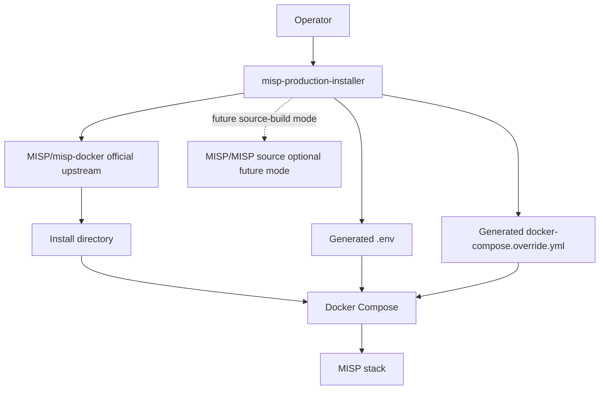

# Architecture

This repository is an installer/overlay project. It does not vendor MISP or the official Docker packaging.

Rule: keep upstream clean. Use `.env`, `docker-compose.override.yml`, scripts, and documented version-gated patches only when no overlay mechanism exists.
